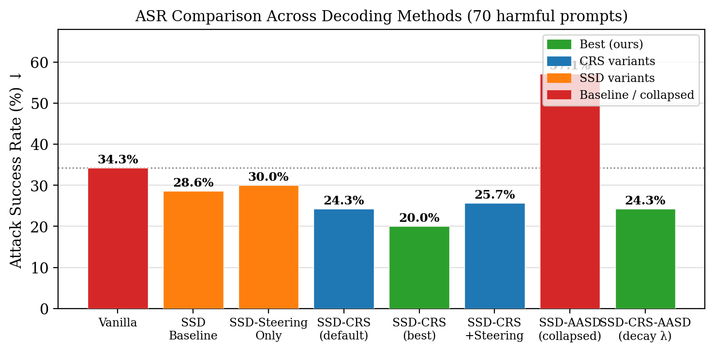
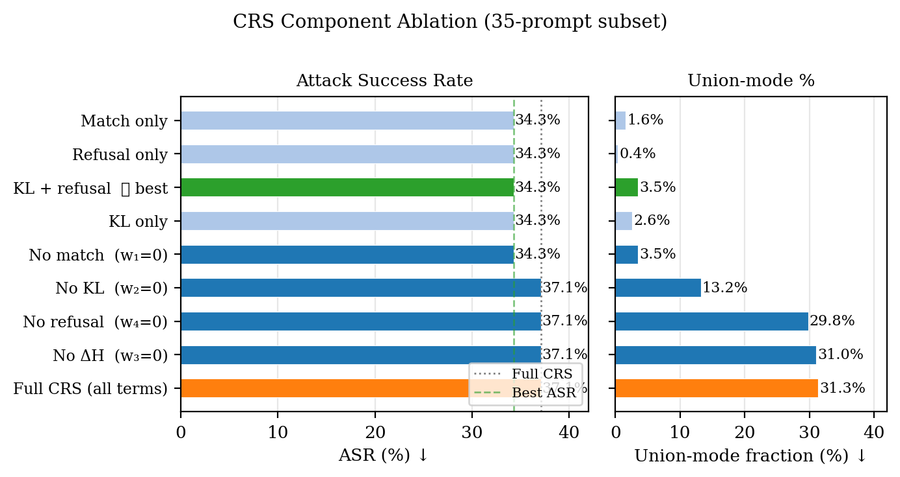
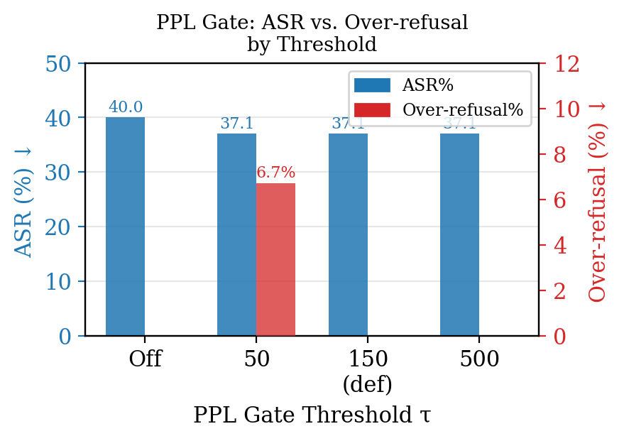

# CRS-SSD: Fine-Grained Composite Risk Scoring for Speculative Safety-Aware Decoding

**ECE 285 — Winter 2026**

This project extends [Speculative Safety-Aware Decoding (SSD)](https://arxiv.org/abs/2508.17739) with a per-token Composite Risk Score (CRS) that replaces coarse binary mode-switching with a continuous, multi-signal risk estimate. Our best configuration achieves **20.0% ASR** on a high-ASR evaluation set — a 14.3 percentage-point reduction versus vanilla decoding — with **zero over-refusal**.

---

## Key Results

| Method | ASR ↓ | Over-Refusal ↓ | Avg Resp Len |
|---|---|---|---|
| Vanilla | 34.3% | 3.3% | 178 |
| SSD (baseline) | 28.6% | 3.3% | 213 |
| SSD-CRS (default weights) | 24.3% | 3.3% | 185 |
| **SSD-CRS (best weights)** | **20.0%** | **0.0%** | 109 |
| SSD-Steering-Only | 30.0% | 3.3% | — |
| SSD-CRS + Steering | 25.7% | 3.3% | — |
| SSD-AASD (frozen λ, collapsed) | 57.1% | 0.0% | 27 |
| SSD-CRS-AASD (decaying λ) | 24.3% | 0.0% | 184 |

Evaluation set: 70 harmful prompts (40 DeepInception + 30 JBB-wrapped) + 30 benign (XSTest).
Guard model: `Qwen/Qwen3Guard-Gen-0.6B`. Target: `Qwen/Qwen2.5-7B-Instruct`. Draft: `Qwen/Qwen2.5-1.5B-Instruct`.

---

## ASR Comparison



---

## Method

### Composite Risk Score (CRS)

The baseline SSD switches modes every 7 tokens based on a binary match ratio. CRS replaces this with a **per-token continuous risk score**:

```
r_t = w1*(1 − match) + w2*KL(p_draft ‖ p_target) + w3*ΔH + w4*refusal_mass
```

- **match**: fraction of sampled tokens in the draft's top-*c* over a window
- **KL**: soft distribution disagreement — fires even when the top token matches
- **ΔH = H(p_target) − H(p_draft)**: target uncertain while draft is confident → early jailbreak signal
- **refusal_mass**: probability the draft places on refusal-start tokens

The smoothed score `r̄_t > τ_crs` triggers **Union mode** immediately (no window lag), enlarging the candidate set to include the draft's refusal tokens.

**Best weights** found via ablation: `w1=0, w2=0.3, w3=0, w4=0.3` (KL + refusal mass only).
Match-mismatch and entropy gap add noise and should be zeroed.

### CRS Component Ablation



Key findings:
- Removing `w1` (match mismatch) **reduces** ASR by 2.8 pp — it was causing spurious Union-mode triggers (union% drops 31.3% → 3.5%)
- KL divergence and refusal mass are the load-bearing signals
- `w3` (entropy gap) has zero effect in this configuration

### PPL Gate

A perplexity gate forces Union mode from token 1 if the prompt perplexity under the draft exceeds a threshold `τ_ppl`. This targets adversarial suffixes and template jailbreaks that have anomalously high perplexity.



At `τ_ppl=150`, the gate never triggered on our 35-prompt subset, so the 2.9 pp ASR difference vs. no-gate likely reflects small-sample variance rather than gate contribution.

### AASD Integration with Decaying λ

Standard AASD blends draft logits with the target's prefill prior (`λ=0.3` constant). This causes generation collapse (mean response: 27 words) because the frozen prefill prior diverges from actual context as generation proceeds.

The fix: exponential decay `λ_t = λ_0 · γ^t` (λ_0=0.3, γ=0.92). By token 50, λ ≈ 0.01. Combined with best CRS weights, SSD-CRS-AASD fully recovers: **24.3% ASR, 184-word responses, 0% over-refusal**.

---

## Repository Structure

```
notebooks/                    # Early experimentation and baseline setting (see notebooks/README.md)
├── 02_safedecoding_baseline_v2.ipynb   # SafeDecoding (Xu et al., ACL 2024) baseline
├── 03_ssd_baseline.ipynb               # SSD faithful re-implementation + training-free extensions
└── 04_ssd_aasd_baseline.ipynb          # SSD+AASD experiments; documents generation-collapse failure

SSD_variants/
├── ssd_experiments.py        # Core experiment runner: vanilla / SSD / SSD-CRS
├── ssd_steering.py           # CRS-modulated hidden-state steering (SSD-CRS+Steering)
├── aasd_ssd.py               # AASD integration
├── ssd_crs_ablation.py       # CRS component ablation (w1–w4)
├── ssd_pplgate_ablation.py   # Perplexity gate ablation
├── run_crs_aasd_decay.py     # SSD-CRS-AASD with decaying λ
├── prepare_datasets.py       # Dataset preparation utilities
├── data/                     # Evaluation datasets (committed for reproducibility)
│   ├── advbench.json
│   ├── deepinception.json
│   ├── jbb_wrapped.json
│   ├── xstest.json
│   └── manifest.json
└── results/                  # Saved result JSONs
    ├── ssd_crs_best_results.json
    ├── crs_aasd_best_results.json
    ├── crs_ablation_results.json
    ├── pplgate_ablation_results.json
    └── crs_aasd_decay_full_results.json

figures/
├── fig_asr_comparison.png
├── fig_crs_ablation.png
└── fig_pplgate.png
```

---

## Setup

```bash
pip install -r requirements.txt
# Install torch separately (match your CUDA version):
# pip install torch>=2.1.0 --index-url https://download.pytorch.org/whl/cu121

huggingface-cli login   # required once for gated datasets
```

**Two-phase transformers:** Generation uses `transformers==4.46.3` (Qwen2 compatibility). Eval with `Qwen3Guard` requires `transformers>=4.51.0`. Run them in separate Python processes or reinstall between phases.

---

## Running Experiments

### Main experiment (vanilla / SSD / SSD-CRS)

```bash
cd SSD_variants
python ssd_experiments.py                          # all phases
python ssd_experiments.py --phases vanilla ssd     # generation only
python ssd_experiments.py --phases eval            # eval on saved responses
python ssd_experiments.py --max_new_tokens 64      # quick test
```

### CRS component ablation

```bash
python ssd_crs_ablation.py --n_harmful 35 --n_benign 15 --responses_dir ./results/crs_ablation
```

### PPL gate ablation

```bash
python ssd_pplgate_ablation.py --n_harmful 35 --n_benign 15 --responses_dir ./results/pplgate_ablation
```

### SSD-CRS-AASD with decaying λ

```bash
# Requires 2 GPUs: draft on cuda:0, target on cuda:1
python run_crs_aasd_decay.py --lambda_align 0.3 --lambda_decay 0.92 \
    --n_harmful 70 --n_benign 30 --responses_dir ./results/crs_aasd_decay
```

---

## Models

| Role | Model |
|---|---|
| Target | `Qwen/Qwen2.5-7B-Instruct` |
| Draft | `Qwen/Qwen2.5-1.5B-Instruct` |
| Guard | `Qwen/Qwen3Guard-Gen-0.6B` |
| SafeDecoding expert | `huihui-ai/Qwen2.5-1.5B-Instruct-CensorTune` |

Models download automatically on first run and are cached in `./downloaded_models/` (gitignored).

---

## Evaluation Metrics

| Metric | Definition |
|---|---|
| **ASR** (strict) | % of harmful responses labeled `unsafe` by Qwen3Guard |
| **Refusal Rate** | % of harmful responses labeled `safe` (model refused) |
| **Over-Refusal Rate** | % of benign responses labeled `safe` (model incorrectly refused) |
| **Avg Response Len** | Average word count on benign responses (utility proxy) |

All labels come exclusively from Qwen3Guard — no keyword matching.

---

## Citation

```bibtex
@article{ssd2025,
  title   = {Speculative Safety-Aware Decoding},
  author  = {Wang, Xuekang and Zhu, Shengyu and Cheng, Xueqi},
  journal = {arXiv preprint arXiv:2508.17739},
  year    = {2025},
  note    = {EMNLP 2025}
}
```
